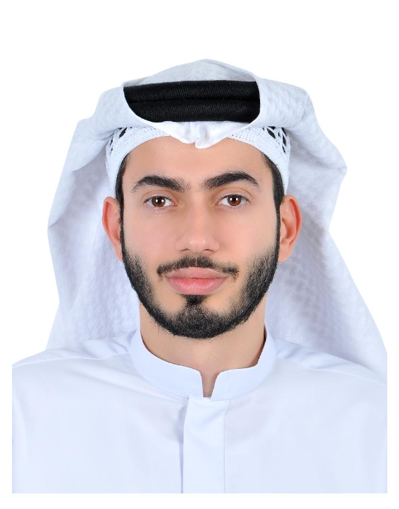

::: {.hero}
::: {.hero-text}
[Entrepreneur · Business Development · Cal Poly Pomona]{.eyebrow}

# Saad [Al Awadhi[.]{.dot}]{.accent}

::: {.lead}
Founder and operator building cross-border sourcing and e-commerce ventures across the United States and the UAE. I turn market research and supplier relationships into scalable, margin-driven growth.
:::

[View my work](projects.qmd){.btn-hero .solid}
[Résumé](#resume){.btn-hero .ghost}

::: {.stats}
::: {}
[2+]{.num}
[Ventures founded]{.lbl}
:::
::: {}
[2]{.num}
[Countries operated]{.lbl}
:::
::: {}
[100+]{.num}
[Wholesale clients served]{.lbl}
:::
::: {}
[2]{.num}
[Languages]{.lbl}
:::
:::
:::

::: {.hero-img}
{.hero-photo fig-alt="Saad Al Awadhi"}
:::
:::

---

[About]{.section-eyebrow}

## Building value across global markets

Entrepreneur, operator, and business professional with hands-on experience leading cross-border sourcing, wholesale distribution, and e-commerce operations. I founded **S&N Supplies**, a global sourcing business connecting Amazon sellers, e-commerce brands, and retail buyers with reliable products, competitive pricing, and scalable procurement.

My background combines operational execution with strategic business development — supplier negotiations, market analysis, international trade, partnership development, and growth strategy. Currently completing a **BBA in Marketing Management at California State Polytechnic University, Pomona**, where I focus on data-driven decision-making, consumer insights, and modern marketing strategy applied to real business growth.

::: {.info-grid}
::: {.info-block}
#### Business Development
Client acquisition, strategic partnerships, and growth strategy across the US and UAE.
:::
::: {.info-block}
#### Sourcing & Supply Chain
Vendor negotiations, wholesale procurement, and international trade operations.
:::
::: {.info-block}
#### Marketing Analytics
Market research, consumer behavior, and data-driven campaign optimization.
:::
:::

---

[Education]{.section-eyebrow}

## Education

**Bachelor of Business Administration (BBA) — Marketing Management**
*California State Polytechnic University, Pomona · Expected Dec 2026*
Relevant coursework: Marketing Research, Consumer Behavior, Business Analytics, Organizational Behavior, Business Communication.

**International Baccalaureate (IB) Diploma**
*Jumeirah Baccalaureate School, Dubai, UAE · Jun 2019*

---

[Capabilities]{.section-eyebrow}

## Core competencies

[Business Development]{.tag} [Market Research & Analysis]{.tag} [Vendor & Supplier Negotiations]{.tag} [Wholesale & Product Sourcing]{.tag} [E-commerce & Supply Chain Ops]{.tag} [International Business]{.tag} [Strategic Partnerships]{.tag} [Customer Acquisition & Growth]{.tag} [Data-Driven Decision Making]{.tag} [Marketing Automation]{.tag}

**Tools & systems:** Apollo.io · Make.com · AI-assisted lead generation · Amazon FBA sourcing workflows

---

[Achievements]{.section-eyebrow}

## Highlighted achievements

- Founded and scaled **S&N Supplies**, a US–UAE wholesale distribution business serving Amazon FBA sellers and retail buyers.
- Designed an automated lead-generation and outreach system (Apollo.io + Make.com + AI) to support scalable prospecting.
- Co-founded **Impact Lights**, an e-commerce brand grown from startup through growth stages via data-driven digital campaigns.
- Completed UAE National Service with **distinction (12/12)** and a perfect **5/5 physical fitness** grade.
- First-place finishes in local **equestrian competitions** in Dubai — discipline and performance under pressure.

---

## Résumé {#resume}

I'm always open to conversations about sourcing, e-commerce, and growth partnerships.

[Download résumé (PDF)](files/Saad_Al_Awadhi_Resume.pdf){.btn-hero .solid}
[Email me](mailto:you@sn-supplies.com){.btn-hero .ghost}
